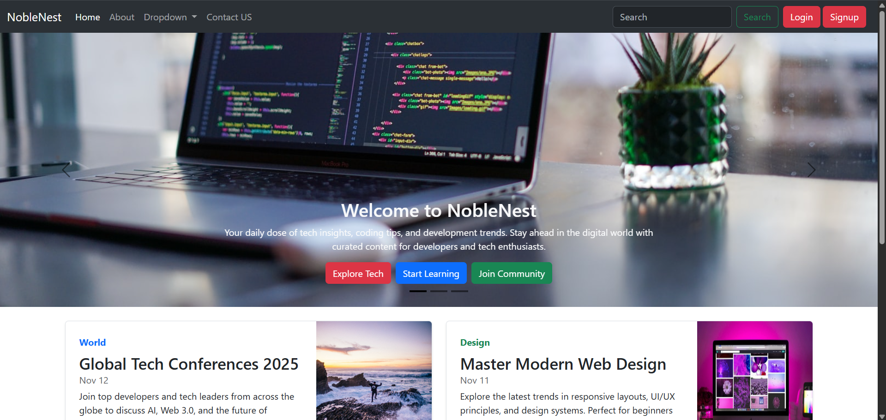

# 📘 NobleNest - Blog Website

Welcome to **NobleNest**, a responsive blog website built using **Bootstrap 5**.  
This project is part of my Bootstrap learning journey where I explored components like navbar, modals, cards, grid system, and responsive layouts.

---

## 📸 Screenshots

### 🏠 Homepage:
 

---

## 🌐 Live Demo

The project is live and can be viewed here: [Blog-webiste](https://blog-website-livid.vercel.app/)

---

## 📌 Features

- Responsive Navbar with Dropdown
- Login and Signup Modals
- Bootstrap Carousel/Featurettes
- Clean UI with Bootstrap Utility Classes
- Scroll to Top Footer

---

## 🛠 Tech Stack

- HTML5
- CSS3
- Bootstrap 5

---

## 📚 Learning Outcome

This project helped me understand:

- How to structure HTML layout using Bootstrap Grid
- Using Bootstrap modals, buttons, and navbar
- Making responsive designs easily with Bootstrap
- Using CDN to include Bootstrap into a project

---

## 🚀 How to Run Locally

1. Clone the repository:
   
   ```bash
   git clone https://github.com/TonyStark-19/Blog-website.git
   ```
3. Navigate to the project folder:
   
   ```bash
   cd Blog-website
   ```
5. Open the `index.html` file in your browser.

---

## 💬 Feedback & Contributions

Feel free to open issues, suggest improvements, or even submit a pull request!
Your feedback is welcome and will help me improve and grow as a developer. 🙌
